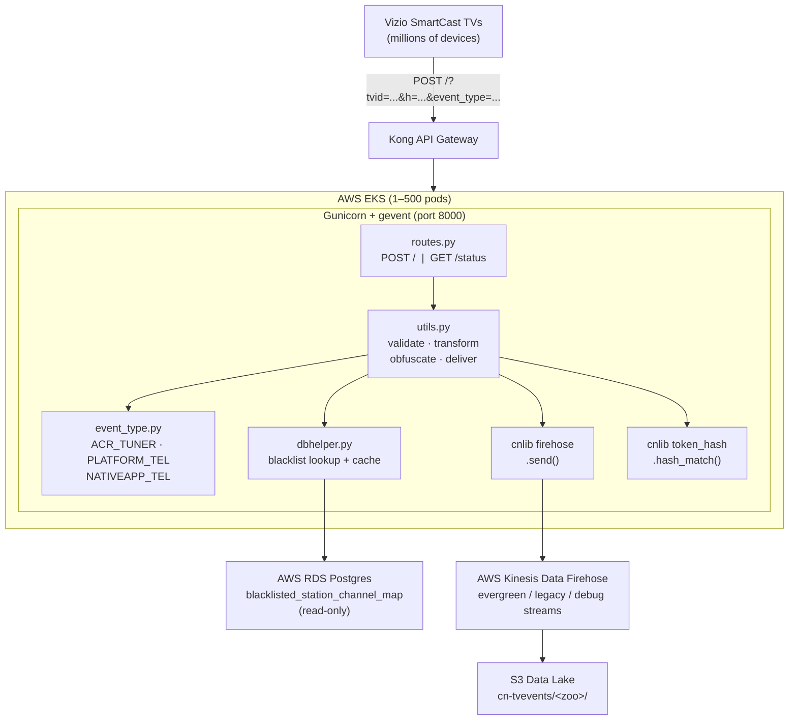

# Component Overview — evergreen-tvevents (tvevents-k8s)

## Summary

**evergreen-tvevents** is a Python 3.10 Flask service that collects TV event
telemetry from Vizio SmartCast TVs. It receives HTTP POST requests containing
JSON payloads, validates them against HMAC security hashes and event-type
schemas, checks for blacklisted channels via PostgreSQL RDS, obfuscates
restricted content, and delivers processed events to AWS Kinesis Data Firehose
streams for downstream analytics. The service runs on AWS EKS behind Kong API
Gateway and scales from 1 pod (dev) to 300–500 pods (production).

| Attribute       | Value                                          |
|-----------------|-------------------------------------------------|
| Language        | Python 3.10                                     |
| Framework       | Flask 3.1.1 / Gunicorn 23.0.0 / gevent 25.5.1  |
| Repository      | CognitiveNetworks/tvevents-k8s                  |
| Compute         | AWS EKS (Kubernetes)                            |
| Data Sink       | AWS Kinesis Data Firehose → S3 data lake        |
| Database        | AWS RDS PostgreSQL (read-only)                  |
| Observability   | OpenTelemetry → New Relic (OTLP HTTP)           |
| Alerting        | PagerDuty (service ID PSV1WEB)                  |
| CI/CD           | GitHub Actions                                  |

## Architecture Diagram



## Data Flow

1. **Ingress** — A SmartCast TV sends an HTTP POST to `/` via Kong API Gateway
   with query parameters (`tvid`, `h`, `event_type`, `client`, `timestamp`) and
   a JSON body containing a `TvEvent` envelope and `EventData`.

2. **Validation** (`utils.validate_request`) —
   - Verify all required parameters are present (`tvid`, `client`, `h`,
     `EventType`, `timestamp`).
   - Confirm URL params match payload params (tvid, event_type).
   - Validate the **security hash** (`h`): an HMAC digest computed from the
     **tvid** (unique TV identifier) and a shared salt (`T1_SALT`), verified via
     `cnlib.token_hash.security_hash_match()`.
   - Validate the timestamp.
   - Dispatch to the polymorphic **EventType** class for schema-specific
     validation.

3. **Transformation** (`utils.generate_output_json`) — Flatten the nested
   `TvEvent`/`EventData` JSON into a single-level output dict. Append metadata:
   `tvevent_timestamp`, `tvevent_eventtype`, **zoo** (deployment environment
   identifier, e.g. `tvevents-k8s`), `namespace`, `appid`.

4. **Blacklist Check** (`utils.should_obfuscate_channel`) — Look up the event's
   `channelid` against the **blacklisted channel** set (channel IDs flagged for
   content restriction). Also check the `iscontentblocked` flag in the payload.

5. **Obfuscation** — If the channel is blacklisted or content-blocked, replace
   `channelid`, `programid`, and `channelname` with `"OBFUSCATED"`.

6. **Delivery** (`utils.send_to_valid_firehoses`) — Send the output JSON to all
   configured **Firehose** streams (AWS Kinesis Data Firehose delivery streams)
   in parallel using `ThreadPoolExecutor`. Firehose delivers to the S3 data
   lake.

## API Surface

| Method | Path      | Description                          | Auth               |
|--------|-----------|--------------------------------------|---------------------|
| POST   | `/`       | Receive and process a TV event       | HMAC security hash  |
| GET    | `/status` | Health check — returns `"OK"`        | None                |

No OpenAPI specification. No API versioning. JSON body structure:

```json
{
  "TvEvent": {
    "tvid": "...",
    "h": "...",
    "EventType": "ACR_TUNER_DATA",
    "timestamp": 1709568000000,
    "client": "..."
  },
  "EventData": { }
}
```
## Source Code Structure

```
repo/
├── app/
│   ├── __init__.py      # Flask app factory, OTEL init, logging setup
│   ├── routes.py        # POST / and GET /status route handlers
│   ├── utils.py         # Validation, transformation, obfuscation, Firehose delivery
│   ├── event_type.py    # Polymorphic EventType classes (ACR, Platform, NativeApp)
│   └── dbhelper.py      # RDS connection, blacklist queries, file-based cache
├── cntools_py3/cnlib/   # Git submodule — Firehose wrapper, HMAC validation, logger
├── tests/               # 17 test files (~1800 lines)
├── charts/              # Helm chart (values.yaml, templates/)
├── .github/workflows/   # CI: black, pytest, pylint, mypy, complexipy, Docker build
├── Dockerfile           # Python 3.10-bookworm, non-root user, gunicorn
├── entrypoint.sh        # AWS config, OTEL setup, blacklist cache init, gunicorn start
├── requirements.txt     # 80+ runtime dependencies
└── requirements-dev.txt # Dev/test dependencies
```

### Module Responsibilities

**`app/__init__.py`** — Flask app factory (`create_app()`). Configures OTEL
tracing, metrics, and logging (OTLP HTTP). Instruments Flask, psycopg2,
botocore, requests, urllib3. Exposes a global `meter` for OTEL counters.

**`app/routes.py`** — `POST /` extracts tvid/payload, calls validation then
Firehose delivery. `GET /status` returns `"OK"`. `before_request` hook logs
every request. Error handler serializes exceptions to JSON with 400 status.

**`app/utils.py`** — Core processing: `validate_request()` orchestrates
validation (required params, HMAC hash, timestamp, EventType schema).
`generate_output_json()` flattens nested JSON. `push_changes_to_firehose()`
handles obfuscation and parallel delivery via `ThreadPoolExecutor`. Defines
custom exception hierarchy (`TvEventsDefaultException` → catchall, missing
param, security validation, invalid payload — all return 400).

**`app/event_type.py`** — Abstract `EventType` base with three implementations:
`AcrTunerDataEventType` (channel/program tuning + heartbeats),
`PlatformTelemetryEventType` (panel ON/OFF via jsonschema),
`NativeAppTelemetryEventType` (app usage). Each implements
`validate_event_type_payload()` and `generate_event_data_output_json()`.

**`app/dbhelper.py`** — `TvEventsRds` manages RDS via psycopg2. Queries
`public.tvevents_blacklisted_station_channel_map`. Three-tier cache: in-memory
→ file (`/tmp/.blacklisted_channel_ids_cache`) → RDS. No connection pooling.

**`cntools_py3/cnlib`** — Git submodule (`CognitiveNetworks/cntools_py3`).
Used for `firehose.Firehose` (Kinesis wrapper), `token_hash.security_hash_match()`
(HMAC validation), `log.getLogger()` (logging). Bundles unused Redis,
memcached, ZeroMQ, and MySQL clients.

## Configuration

All configuration is via environment variables. No config files at runtime.

| Variable                  | Purpose                                           |
|---------------------------|---------------------------------------------------|
| `T1_SALT`                 | Shared HMAC salt for security hash validation      |
| `FLASK_ENV`               | Zoo identifier (e.g. `tvevents-k8s`)              |
| `RDS_HOST/DB/USER/PASS/PORT` | PostgreSQL connection parameters                |
| `SEND_EVERGREEN`          | Enable evergreen Firehose stream (`true/false`)    |
| `SEND_LEGACY`             | Enable legacy Firehose stream (`true/false`)       |
| `EVERGREEN_FIREHOSE_NAME` | Evergreen stream name                             |
| `LEGACY_FIREHOSE_NAME`   | Legacy stream name                                 |
| `DEBUG_*_FIREHOSE_NAME`  | Debug stream names (evergreen + legacy)            |
| `TVEVENTS_DEBUG`          | Enable debug Firehose delivery (`true/false`)      |
| `BLACKLIST_CHANNEL_IDS_CACHE_FILEPATH` | Path to blacklist file cache          |
| `WEB_CONCURRENCY`         | Gunicorn worker count (default 3)                 |
| `LOG_LEVEL`               | Application log level                              |
| `SERVICE_NAME`            | OTEL service name                                  |
| `OTEL_*` vars             | OTEL auto-instrumentation and OTLP export config   |
| `AWS_REGION`              | AWS region for Firehose/RDS                        |

## Infrastructure

### Compute

Deployed to AWS EKS via Helm chart. Kubernetes resources per pod: 3500m CPU,
512Mi memory. Scaling policy:

| Environment | Min Pods | Max Pods |
|-------------|----------|----------|
| Dev         | 1        | 10       |
| Staging     | 1        | 10       |
| QA          | 1        | 200      |
| Production  | 300      | 500      |

HPA triggers at 70% CPU utilization. Scale-up: max(50%/15s, 8 pods/15s).
Scale-down: 25%/30s with 60s stabilization. Rolling update: 50% max surge,
25% max unavailable.

### Container

Python 3.10-bookworm base image. Non-root user (`flaskuser`, UID 10000).
Gunicorn with gevent worker class, 500 worker connections per process,
max 100,000 requests per worker before recycling. Listens on `[::]:8000`.
Docker HEALTHCHECK polls `/status` every 30s.

### Networking

Kong API Gateway routes external traffic to a ClusterIP Service on port 80,
which forwards to container port 8000.

### Database

AWS RDS PostgreSQL. Single table used:
`public.tvevents_blacklisted_station_channel_map` (read-only). Direct
`psycopg2` connections per query — no connection pooling.

### Firehose Streams

Up to four Kinesis Data Firehose streams configured per environment:

| Stream                      | Controlled By          | Destination              |
|-----------------------------|------------------------|--------------------------|
| Evergreen Firehose          | `SEND_EVERGREEN=true`  | S3 `cn-tvevents/<zoo>/`  |
| Legacy Firehose             | `SEND_LEGACY=true`     | S3 legacy bucket         |
| Debug Evergreen Firehose    | `TVEVENTS_DEBUG=true`  | Debug S3 prefix          |
| Debug Legacy Firehose       | `TVEVENTS_DEBUG=true`  | Debug S3 prefix          |

### Observability

- **Tracing**: OpenTelemetry spans on every route, DB query, Firehose send,
  and EventType operation. Exported via OTLP HTTP to New Relic.
- **Metrics**: OTEL counters for Firehose sends, DB connections, DB errors,
  cache reads/writes, payload validations, heartbeats, panel data checks.
  DB query duration histogram.
- **Logging**: cnlib logger + OTEL LoggingHandler. Logs exported to New Relic
  via OTLP.
- **Health check**: `GET /status` returns `"OK"` (no dependency verification).
- **Alerting**: PagerDuty via `pygerduty` (service ID PSV1WEB).

### CI/CD

GitHub Actions workflows:
- **commit.yml** — runs on every push: black (formatting), pytest, pylint,
  mypy (type checking), complexipy (complexity).
- **master-build-push-container.yaml** — builds and pushes Docker image on
  merge to master.
- **pre-release-build-push-container.yaml** — builds on pre-release branches.
- **enforce-gitflow.yaml** — branch protection enforcement.

## Dependencies

### Key Runtime Packages

Flask 3.1.1, gunicorn 23.0.0, gevent 25.5.1, psycopg2-binary 2.9.10,
boto3 1.38.14, jsonschema 3.2.0, pygerduty 0.38.3, 20+ OTEL packages.
Unused cnlib transitive deps: redis 6.0.0, pyzmq 26.4.0, pymemcache 4.0.0.

### Internal Libraries

cnlib (cntools_py3 git submodule) — Firehose delivery, HMAC validation, logging.

### External Services

AWS Kinesis Data Firehose (event delivery), AWS RDS PostgreSQL (blacklist
lookup), New Relic (observability via OTLP), PagerDuty (alerting via pygerduty).

## Known Constraints

- **cntools_py3 submodule** — bundles unused Redis, memcached, ZeroMQ, MySQL.
- **No connection pooling** — per-query psycopg2 connections.
- **File-based cache** — `/tmp/.blacklisted_channel_ids_cache`, not shared across pods.
- **No OpenAPI spec** — endpoints undocumented beyond source code.
- **gevent monkey-patching** — no native async.
- **Shallow health check** — `/status` does not verify RDS or Firehose.
- **80+ runtime dependencies** — many unused OTEL instrumentors.
