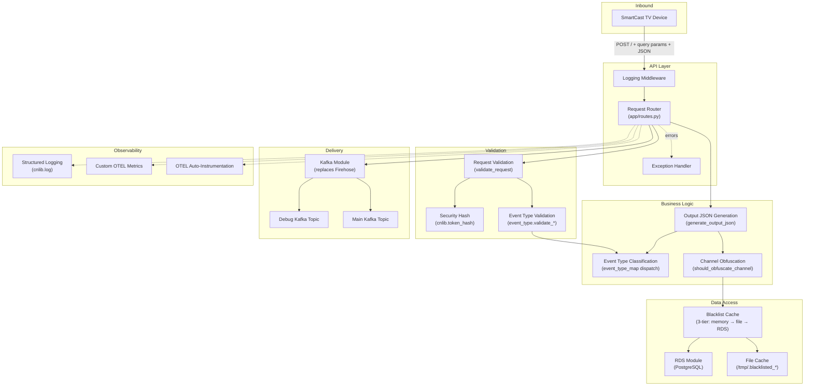

# Component Overview

> **Reference document.** This is analysis output from the ideation process.

This document decomposes the legacy `evergreen-tvevents` service into logical
components, maps each to a rebuild action, and describes how they interact. It
serves as the foundation for specification-driven development in subsequent
rebuild steps.

---

## 1. Component Inventory

| # | Component Name | Source File(s) | Type | Rebuild Action | Target Location |
|---|---|---|---|---|---|
| 1 | Application Factory | `app/__init__.py` | Infrastructure | Rewrite | `app/__init__.py` |
| 2 | Request Router | `app/routes.py` | API | Rewrite | `app/routes.py` |
| 3 | Request Validation | `app/utils.py` (validate funcs) | Security | Port | `app/validation.py` |
| 4 | Event Type Classification | `app/event_type.py` | Business Logic | Port | `app/event_type.py` |
| 5 | Output JSON Generation | `app/utils.py` (generate/flatten funcs) | Business Logic | Port | `app/output.py` |
| 6 | Channel Obfuscation | `app/utils.py` (obfuscation funcs) | Business Logic | Port | `app/obfuscation.py` |
| 7 | Blacklist Cache (3-Tier) | `app/dbhelper.py` | Data Access | Port | `app/blacklist.py` |
| 8 | RDS Data Access | `app/dbhelper.py` (`_connect`, `_execute`) | Data Access | Replace | Standalone RDS module (external) |
| 9 | Firehose Delivery | `app/utils.py` (firehose funcs), `cnlib.firehose` | Infrastructure | Replace | Standalone Kafka module (external) |
| 10 | Security Hash Validation | `app/utils.py` (`validate_security_hash`), `cnlib.token_hash` | Security | Port | `app/validation.py` (delegates to cnlib) |
| 11 | Custom Exceptions | `app/utils.py` (exception classes) | API | Port | `app/exceptions.py` |
| 12 | OTEL Manual Setup | `app/__init__.py` (TracerProvider, MeterProvider, LoggerProvider) | Observability | Drop | Auto-instrumentation via `FastAPIInstrumentor` |
| 13 | Structured Logging | `app/__init__.py` (`configure_logging`, `cnlib.log`) | Observability | Port | `app/__init__.py` (cnlib.log retained) |
| 14 | Custom OTEL Metrics | `app/routes.py`, `app/utils.py`, `app/dbhelper.py`, `app/event_type.py` | Observability | Port | Co-located with owning component |
| 15 | Entrypoint & Env Check | `entrypoint.sh`, `environment-check.sh` | Infrastructure | Rewrite | `entrypoint.sh`, `environment-check.sh` (template-repo-python pattern) |
| 16 | Dockerfile | `Dockerfile` | Infrastructure | Rewrite | `Dockerfile` (Python 3.12, uvicorn, template-repo-python pattern) |

---

## 2. Component Descriptions

### 2.1 Application Factory

- **What it does:** Creates and configures the web application. In legacy this
  is `create_app()` which builds a Flask instance, manually initializes OTEL
  TracerProvider / MeterProvider / LoggerProvider, instruments six libraries,
  registers the Blueprint, and calls `init_routes()`.
- **Key interfaces:** `create_app() → Flask`, `configure_logging() → Logger`,
  module-level `meter` object.
- **Dependencies:** Flask, all OTEL SDK packages, cnlib.log, `app.routes`.
- **State:** Module-level `meter`, `logger_provider`, `otel_handler`, `log_level`.
- **Rebuild notes:** Rewrite as a FastAPI factory with `asynccontextmanager`
  lifespan (matching template-repo-python). Drop all manual OTEL provider
  setup — use `FastAPIInstrumentor` and OTEL auto-instrumentation. Retain
  `configure_logging()` with cnlib.log. Expose `meter` for custom metrics.

### 2.2 Request Router

- **What it does:** Defines HTTP endpoints and middleware. Legacy has a Flask
  Blueprint with `POST /` (`send_request_firehose`), `GET /status`, a
  `before_request` log-everything middleware, and a custom error handler for
  `TvEventsCatchallException`.
- **Key interfaces:** `POST /` accepts query params (`tvid`, `client`, `h`,
  `EventType`, `timestamp`) and a JSON body. Returns `"OK"` or error JSON with
  status code. `GET /status` returns `"OK"`.
- **Dependencies:** `app.utils` (validate_request, push_changes_to_firehose,
  TvEventsCatchallException), OTEL tracer, meter.
- **State:** None (stateless handler).
- **Rebuild notes:** Rewrite as a FastAPI `APIRouter`. Convert
  `before_request` to an async middleware (skip `/status`). Replace Flask
  `errorhandler` with FastAPI exception handlers. The route contract (`POST /`
  query params + JSON body → `"OK"`) must remain byte-compatible with existing
  TV device firmware.

### 2.3 Request Validation

- **What it does:** Validates every incoming POST request through a pipeline:
  required-param check → param-match check (URL vs payload) → timestamp check →
  security-hash check → event-type-specific validation.
- **Key interfaces:** `validate_request(url_params, payload) → True | raises`,
  `verify_required_params(payload, required_params)`,
  `timestamp_check(ts, tvid, is_ms)`, `params_match_check(name, url, payload)`,
  `validate_security_hash(tvid, h_value)`.
- **Dependencies:** `cnlib.token_hash.security_hash_match`, `SALT_KEY`
  (from `T1_SALT` env var), custom exceptions, event_type_map.
- **State:** `REQUIRED_PARAMS` tuple, `SALT_KEY` read once at import.
- **Rebuild notes:** Port to a dedicated `app/validation.py`. Logic is
  unchanged. `validate_security_hash` continues to delegate to cnlib.
  `REQUIRED_PARAMS` and `SALT_KEY` move with it.

### 2.4 Event Type Classification

- **What it does:** Dispatches payload processing by `EventType` value.
  Abstract base `EventType` class with two abstract methods:
  `validate_event_type_payload()` and `generate_event_data_output_json()`.
  Three concrete implementations:
  - **NativeAppTelemetryEventType** — validates `Timestamp` in EventData,
    namespace from EventData.
  - **AcrTunerDataEventType** — validates `channelData`/`programData` or
    `Heartbeat`, namespace from TvEvent.
  - **PlatformTelemetryEventType** — JSON schema validation for `PanelData`
    (PanelState ON/OFF, WakeupReason 0–128).
- **Key interfaces:** `event_type_map` dict mapping string → class,
  `validate_event_type_payload() → True | raises`,
  `generate_event_data_output_json() → dict`.
- **Dependencies:** `app.utils` (verify_required_params, timestamp_check,
  flatten_request_json, get_payload_namespace, custom exceptions), `jsonschema`.
- **State:** Each instance holds its `payload`, `event_type`, `tvid`,
  `event_data_params`, `namespace`, `appid`.
- **Rebuild notes:** Port as-is. No business-logic changes. Retain the
  validation schemas and dispatch map. Add OTEL counter metrics inline.

### 2.5 Output JSON Generation

- **What it does:** Transforms the nested inbound payload into a flat output
  JSON document suitable for downstream delivery. Merges TvEvent fields,
  EventData fields (via event-type-specific generators), adds `zoo`, `namespace`,
  `appid`.
- **Key interfaces:** `generate_output_json(request_json) → dict`,
  `flatten_request_json(json, key_prefix, ignore_keys) → dict`,
  `get_payload_namespace(payload) → str | None`.
- **Dependencies:** Event type classification (for per-type output generation),
  `ZOO` env var (`FLASK_ENV`).
- **State:** None.
- **Rebuild notes:** Port to `app/output.py`. Rename the `ZOO`/`FLASK_ENV`
  reference to use the `ENV` variable (per template-repo-python).
  `flatten_request_json` is a pure function — port unchanged.

### 2.6 Channel Obfuscation

- **What it does:** Determines whether channel-identifying fields
  (`channelid`, `programid`, `channelname`) should be replaced with
  `"OBFUSCATED"`. Decision is based on `iscontentblocked` flag OR blacklist
  membership. When obfuscating, optionally sends the un-obfuscated payload to
  debug streams first.
- **Key interfaces:** `should_obfuscate_channel(output_json) → bool`,
  `is_blacklisted_channel(channelid) → bool`.
- **Dependencies:** Blacklist cache (`TVEVENTS_RDS.blacklisted_channel_ids()`).
- **State:** None (reads from blacklist cache).
- **Rebuild notes:** Port to `app/obfuscation.py`. Logic unchanged.
  `is_blacklisted_channel` calls into the blacklist cache component.

### 2.7 Blacklist Cache (3-Tier)

- **What it does:** Provides blacklisted channel IDs through a 3-tier lookup:
  in-memory dict → JSON file on disk → RDS query. On startup, populates file
  cache from RDS. At runtime, memory is populated from file on first access;
  falls back to RDS if file is missing.
- **Key interfaces:** `TvEventsRds.blacklisted_channel_ids() → list`,
  `initialize_blacklisted_channel_ids_cache()`,
  `store_data_in_channel_ids_cache(ids)`,
  `read_data_from_channel_ids_cache() → list | None`.
- **Dependencies:** RDS data access (for DB queries), filesystem (for JSON
  cache at `BLACKLIST_CHANNEL_IDS_CACHE_FILEPATH`).
- **State:** `_blacklisted_channel_ids` (in-memory list),
  `_channel_id_cache_last_updated` (unused but present),
  `BLACKLIST_CHANNEL_IDS_CACHE_FILEPATH` (default `/tmp/.blacklisted_channel_ids_cache`).
- **Rebuild notes:** Port to `app/blacklist.py` as a standalone class. Preserve
  the 3-tier cache exactly (file cache, NOT Redis — mandatory constraint).
  The class will consume the standalone RDS module for DB access instead of
  embedding psycopg2 directly. OTEL cache metrics retained.

### 2.8 RDS Data Access

- **What it does:** Manages PostgreSQL connections and query execution. In
  legacy, `TvEventsRds._connect()` reads `RDS_HOST`/`RDS_DB`/`RDS_USER`/
  `RDS_PASS`/`RDS_PORT` from env vars and creates a psycopg2 connection.
  `_execute(query)` opens a connection, runs SQL, returns results, then closes.
  No connection pooling.
- **Key interfaces:** `_connect() → connection`, `_execute(query) → list[dict]`,
  `fetchall_channel_ids_from_blacklisted_station_channel_map() → list[str]`.
- **Dependencies:** psycopg2, PostgreSQL RDS instance, OTEL tracer + metrics.
- **State:** Per-call connection (no pooling).
- **Rebuild notes:** **Replace** with standalone RDS Python module (external
  to this repo). The module should provide connection pooling (asyncpg or
  psycopg pool), parameterized queries, and OTEL-instrumented spans. This
  service will import the module and call it for blacklist queries. The
  standalone module is specified/built separately.

### 2.9 Firehose Delivery

- **What it does:** Sends processed output JSON to AWS Kinesis Firehose
  streams. Supports up to 6 streams (evergreen + legacy × normal + debug),
  toggled by `SEND_EVERGREEN`/`SEND_LEGACY` env vars. Uses
  `cnlib.firehose.Firehose` for the put-record call. Sends to all active
  streams in parallel via `ThreadPoolExecutor`.
- **Key interfaces:** `send_to_valid_firehoses(data, debug_flag)`,
  `push_changes_to_firehose(payload)`.
- **Dependencies:** cnlib.firehose, boto3, `VALID_TVEVENTS_FIREHOSES` /
  `VALID_TVEVENTS_DEBUG_FIREHOSES` lists, ThreadPoolExecutor.
- **State:** Module-level firehose name lists built at import from env vars.
- **Rebuild notes:** **Replace** with standalone Kafka Python module (external
  to this repo). The Kafka module should provide async `produce()`, topic
  configuration, and OTEL-instrumented spans. The in-repo delivery layer
  (`push_changes_to_firehose`) will be rewritten to call the Kafka module.
  Debug-stream logic maps to a debug Kafka topic. ThreadPoolExecutor is
  replaced by async produce calls.

### 2.10 Security Hash Validation

- **What it does:** Validates the `h` parameter against `tvid` using a shared
  salt (`T1_SALT`). Calls `cnlib.token_hash.security_hash_match(tvid, h, salt)`.
- **Key interfaces:** `validate_security_hash(tvid, h_value) → True | raises`.
- **Dependencies:** `cnlib.token_hash`, `T1_SALT` env var.
- **State:** `SALT_KEY` read once at import.
- **Rebuild notes:** Port unchanged into `app/validation.py`. cnlib remains the
  authoritative implementation. The algorithm must not change — TV firmware
  computes the same hash.

### 2.11 Custom Exceptions

- **What it does:** Defines the exception hierarchy used across the service.
  `TvEventsDefaultException` (base, status 400), `TvEventsCatchallException`,
  `TvEventsMissingRequiredParamError`, `TvEventsSecurityValidationError`,
  `TvEventsInvalidPayloadError`.
- **Key interfaces:** Raised by validation/route code, caught by the error
  handler in routes.
- **Dependencies:** None.
- **State:** `status_code = 400` on base class.
- **Rebuild notes:** Port to `app/exceptions.py`. Wire into FastAPI exception
  handlers. Response shape (`{"error": type, "message": msg}` + status code)
  must remain backward-compatible.

### 2.12 OTEL Manual Setup

- **What it does:** In legacy, `app/__init__.py` manually creates
  `TracerProvider`, `MeterProvider`, `LoggerProvider` with OTLP HTTP exporters,
  then calls `.instrument()` on six libraries (Flask, psycopg2, botocore,
  boto3-sqs, requests, urllib3).
- **Key interfaces:** Module-level provider setup, `meter = get_meter(__name__)`.
- **Dependencies:** `opentelemetry-sdk`, `opentelemetry-exporter-otlp-proto-http`,
  six `opentelemetry-instrumentation-*` packages.
- **State:** Global providers registered at import time.
- **Rebuild notes:** **Drop entirely.** The rebuilt service uses OTEL
  auto-instrumentation (`opentelemetry-instrument` CLI or
  `FastAPIInstrumentor`), matching template-repo-python. The `meter` object is
  still created via `get_meter()` for custom metrics, but providers are
  configured automatically. This eliminates ~50 lines of boilerplate.

### 2.13 Structured Logging

- **What it does:** Configures structured JSON logging via `cnlib.log.getLogger`.
  Attaches an OTEL `LoggingHandler` so log records are exported to OTLP.
  `LOG_LEVEL` is read from env and validated by `compute_valid_log_level()`.
- **Key interfaces:** `configure_logging() → Logger`,
  `compute_valid_log_level(level) → int`.
- **Dependencies:** `cnlib.log`, OTEL LoggerProvider.
- **State:** Module-level `log_level`, `logger_provider`, `otel_handler`.
- **Rebuild notes:** Port. Continue using `cnlib.log`. The OTEL LoggingHandler
  integration may simplify under auto-instrumentation (verify at build time).

### 2.14 Custom OTEL Metrics

- **What it does:** Creates counters and histograms for business-level
  observability. Spread across all source files:
  - `routes.py`: `send_request_firehose_counter`
  - `utils.py`: `send_to_valid_firehoses_counter`
  - `dbhelper.py`: `connect_to_db_counter`, `db_connection_error_counter`,
    `db_query_duration_seconds`, `read_from_db_counter`, `write_to_db_counter`,
    `db_query_error_counter`, `read_from_cache_counter`,
    `write_to_cache_counter`
  - `event_type.py`: `validate_payload_counter`,
    `generate_event_data_output_counter`, `heart_beat_counter`,
    `verify_panel_data_counter`
- **Key interfaces:** `meter.create_counter(...)`, `meter.create_histogram(...)`.
- **Dependencies:** Module-level `meter` from app factory.
- **State:** Module-level metric instruments.
- **Rebuild notes:** Port each metric to its new owning component. DB-related
  metrics move to the standalone RDS module. Cache metrics stay in
  `app/blacklist.py`. Event-type and request metrics stay in their respective
  modules.

### 2.15 Entrypoint & Environment Check

- **What it does:** `entrypoint.sh` sources `environment-check.sh`, creates AWS
  config, sets OTEL headers, initializes blacklist cache (via a one-shot
  `python -c` call), then starts Gunicorn with gevent workers.
  `environment-check.sh` validates env var groups (rds, firehose, app, otel).
- **Key interfaces:** Shell scripts, env var contracts.
- **Dependencies:** All env vars listed in environment-check.sh, Python app
  (for cache init), Gunicorn.
- **State:** Filesystem (AWS config, cache file).
- **Rebuild notes:** Rewrite both scripts to match template-repo-python
  patterns. Replace Gunicorn with uvicorn. Update env var groups: drop
  `FLASK_ENV`/`FLASK_APP`, drop Firehose vars, add Kafka vars. Retain
  blacklist-cache initialization call. Port the cache-init `python -c`
  invocation.

### 2.16 Dockerfile

- **What it does:** Builds the container image. Python 3.10-bookworm base,
  copies app + cnlib, installs requirements, runs `cnlib/setup.py install`,
  runs `opentelemetry-bootstrap`, creates non-root `flaskuser` (UID 10000),
  exposes port 8000.
- **Key interfaces:** Docker build, exposes port 8000.
- **Dependencies:** requirements.txt, cnlib, entrypoint.sh, environment-check.sh.
- **State:** Container filesystem.
- **Rebuild notes:** Rewrite to match template-repo-python. Python 3.12-bookworm,
  `containeruser` (UID 10000), pip-compile with hashes, uvicorn entrypoint,
  port 8000. cnlib installation approach TBD (setup.py or pip install).

---

## 3. Component Interaction Diagram



---

## 4. Data Flow

The request lifecycle proceeds through the following stages:

### Stage 1 — Ingress

A SmartCast TV device sends `POST /` with query parameters (`tvid`, `client`,
`h`, `EventType`, `timestamp`) and a JSON body containing `TvEvent` and
`EventData` objects. The logging middleware captures the raw request.

### Stage 2 — Validation Pipeline

`validate_request()` runs five checks in sequence:

1. **Required params** — `verify_required_params()` ensures `tvid`, `client`,
   `h`, `EventType`, `timestamp` exist in the payload's `TvEvent` object.
2. **Param match** — `params_match_check()` warns if URL query params diverge
   from the payload values for `tvid` and `event_type`.
3. **Timestamp** — `timestamp_check()` ensures the timestamp is a valid
   Unix epoch (milliseconds).
4. **Security hash** — `validate_security_hash()` calls
   `cnlib.token_hash.security_hash_match(tvid, h, T1_SALT)`. Raises
   `TvEventsSecurityValidationError` on mismatch.
5. **Event-type-specific** — Dispatches to the matching `EventType` subclass
   via `event_type_map`. Each subclass validates its own required fields
   (e.g., PlatformTelemetry validates PanelData JSON schema).

### Stage 3 — Output Generation

`generate_output_json()` transforms the nested payload:

1. Flattens `TvEvent` fields (excluding `h`, `timestamp`, `EventType`) via
   `flatten_request_json()` with underscore-delimited lowercase keys.
2. Adds `tvevent_timestamp`, `tvevent_eventtype`, `zoo` (environment name).
3. Dispatches to the event-type's `generate_event_data_output_json()` which
   flattens `EventData` with type-specific transforms (e.g., Heartbeat
   flagging, PanelState uppercasing, timestamp unit conversion).
4. Adds `namespace` and `appid` from the event-type instance.

### Stage 4 — Channel Obfuscation

`should_obfuscate_channel()` checks two conditions:

1. `iscontentblocked` flag in the output JSON (string or bool).
2. `is_blacklisted_channel(channelid)` which calls
   `TVEVENTS_RDS.blacklisted_channel_ids()`.

The blacklist lookup follows the 3-tier cache: memory → file → RDS. If
obfuscation is required and debug mode is on, the un-obfuscated payload is
sent to the debug topic first. Then `channelid`, `programid`, `channelname`
are replaced with `"OBFUSCATED"`.

### Stage 5 — Delivery

In legacy, `send_to_valid_firehoses()` fans out the output JSON to all
active Firehose streams using `ThreadPoolExecutor` and `cnlib.firehose`.

In the rebuild, this becomes an async call to the standalone Kafka module's
`produce()` method, targeting the configured topic(s). Debug delivery maps to
a separate debug topic.

### Stage 6 — Response

The route returns `"OK"` (200). On any validation or processing error, the
exception hierarchy catches it and the error handler returns
`{"error": "<type>", "message": "<msg>"}` with status 400.

---

## 5. Dependency Map

### Intra-Service Dependencies

```
Request Router
├── Request Validation
│   ├── Security Hash Validation (→ cnlib.token_hash)
│   └── Event Type Classification
│       └── Event Type Validation (per subclass)
├── Output JSON Generation
│   ├── Event Type Classification (for per-type output)
│   └── Channel Obfuscation
│       └── Blacklist Cache
│           ├── File Cache (filesystem)
│           └── RDS Data Access (standalone module)
├── Delivery (standalone Kafka module)
├── Custom Exceptions
├── Structured Logging (→ cnlib.log)
└── Custom OTEL Metrics
```

### External Dependencies

| Dependency | Used By | Protocol | Notes |
|---|---|---|---|
| **PostgreSQL RDS** | Blacklist Cache → RDS Module | TCP/5432 (psycopg2) | Blacklist channel ID lookups. Standalone module. |
| **Kafka (replaces Firehose)** | Delivery layer | Kafka protocol | Event delivery to downstream pipeline. Standalone module. |
| **cnlib.token_hash** | Security Hash Validation | In-process (vendored) | T1_SALT hash algorithm. Must not change. |
| **cnlib.log** | Structured Logging | In-process (vendored) | Structured JSON logger. |
| **OTEL Collector** | Auto-instrumentation, custom metrics, logs | OTLP/HTTP | Exports to New Relic. |

### Standalone Module Boundaries

Two components are explicitly extracted into separate repositories/packages:

1. **Standalone RDS Module** — Owns PostgreSQL connection management (pooling,
   health checks, parameterized queries, OTEL spans). This repo imports it and
   calls `execute(query, params)` from the blacklist cache component.

2. **Standalone Kafka Module** — Owns Kafka producer management (connection,
   topic config, serialization, OTEL spans). This repo imports it and calls
   `produce(topic, data)` from the delivery component.

These modules are specified and built outside this repository. This service
depends on them as pip-installable packages.

### Environment Variable Contract

| Variable Group | Components | Rebuild Status |
|---|---|---|
| `RDS_HOST`, `RDS_DB`, `RDS_USER`, `RDS_PASS`, `RDS_PORT` | RDS Module | Retained (consumed by standalone module) |
| `T1_SALT` | Security Hash Validation | Retained |
| `BLACKLIST_CHANNEL_IDS_CACHE_FILEPATH` | Blacklist Cache | Retained |
| `ENV` (replaces `FLASK_ENV`) | Output JSON Generation, environment-check | Renamed |
| `LOG_LEVEL` | Structured Logging | Retained |
| `SERVICE_NAME` | OTEL, Logging | Retained |
| `OTEL_*` | Auto-instrumentation | Retained (simplified) |
| `SEND_EVERGREEN`, `SEND_LEGACY`, `*_FIREHOSE_NAME` | Firehose Delivery | **Dropped** — replaced by Kafka topic config |
| `FLASK_ENV`, `FLASK_APP` | Flask/Gunicorn | **Dropped** |
| Kafka vars (TBD) | Kafka Module | **New** — defined by standalone Kafka module |
