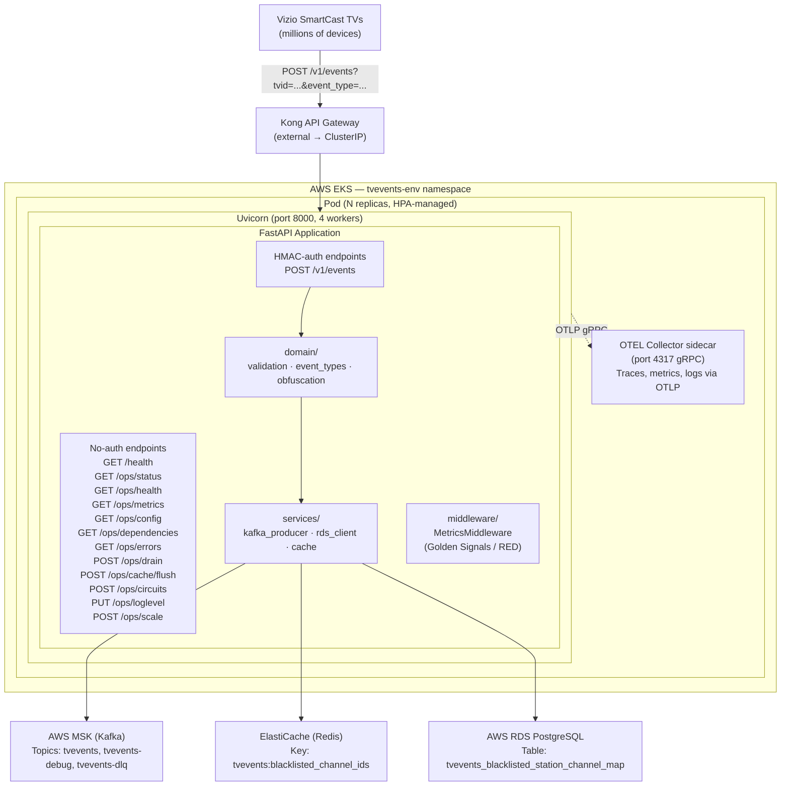
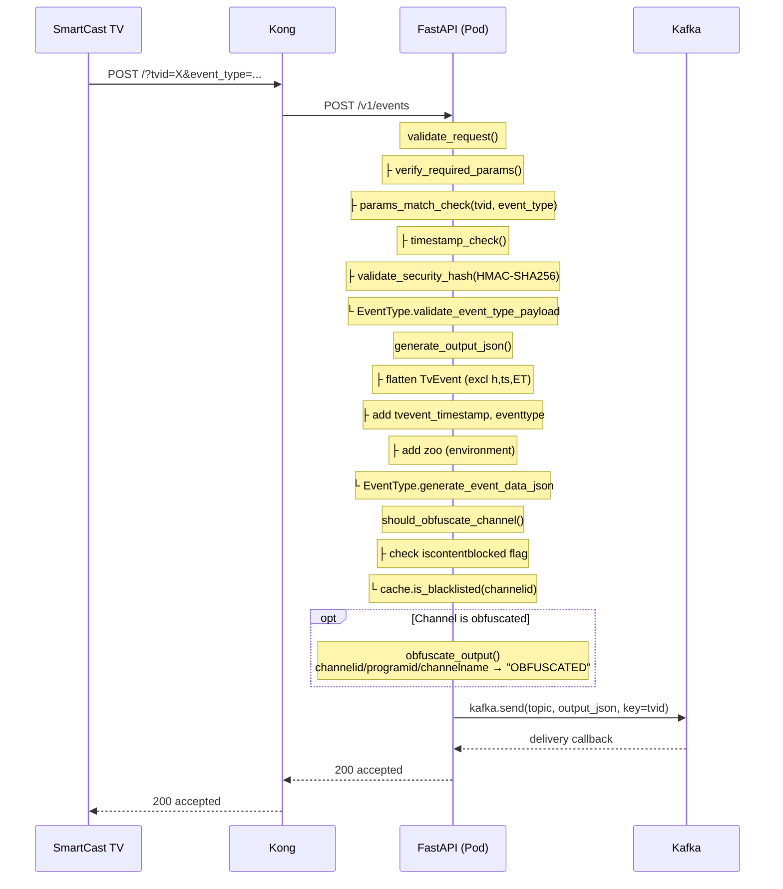
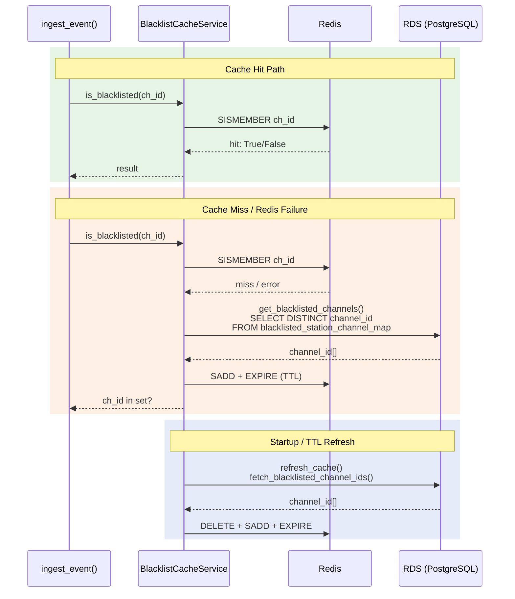
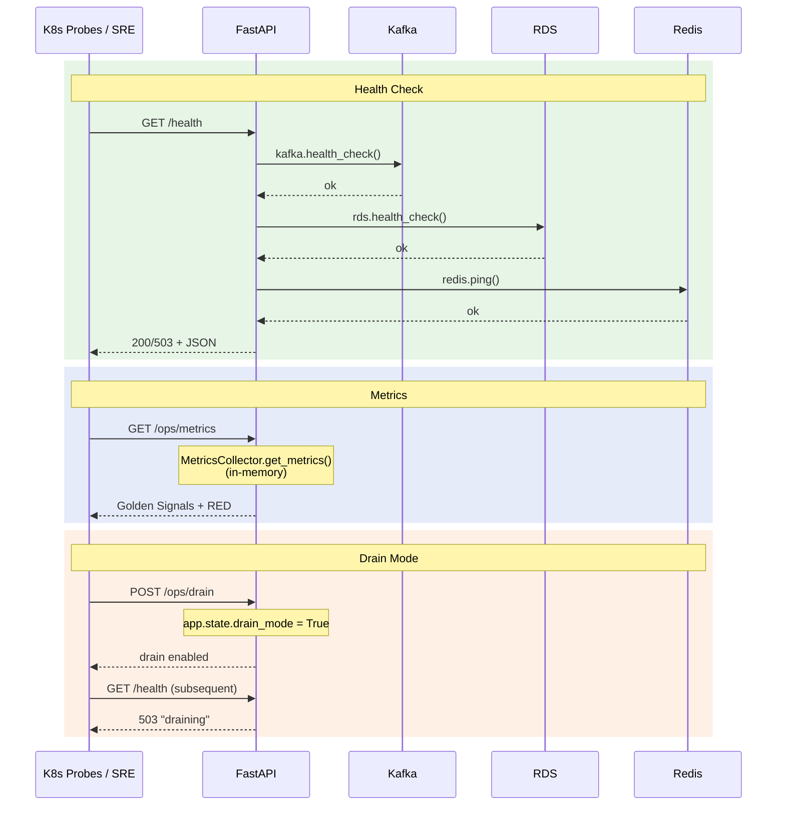
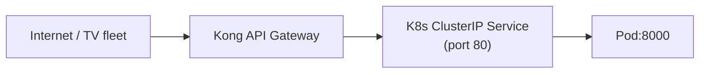

# Target Architecture — rebuilder-evergreen-tvevents

> This document describes the **target state only**. For the legacy architecture,
> see [docs/component-overview.md](component-overview.md).

---

## 1. What Changed — Legacy to Target Module Mapping

| Legacy Component | Legacy Location | Target Module | Target Location | Responsibility |
|---|---|---|---|---|
| Flask app factory, OTEL init, logging | `app/__init__.py` | App factory, lifespan, OTEL bootstrap, structured logging | `src/tvevents/main.py` | Creates FastAPI app; initialises OTEL tracing, metrics, and log export; manages startup/shutdown of Kafka, RDS, Redis, and blacklist cache via async lifespan |
| Route handlers (`POST /`, `GET /status`) | `app/routes.py` | Event ingestion endpoint (`POST /v1/events`) | `src/tvevents/api/routes.py` | Receives TV event payload, orchestrates validation → transformation → obfuscation → Kafka delivery; returns typed Pydantic response |
| Health check (`GET /status` — plain "OK") | `app/routes.py` | Dependency-aware health check (`GET /health`) | `src/tvevents/api/health.py` | Checks Kafka, RDS, and Redis connectivity; returns 200/503 with per-dependency status and latency |
| Pydantic request/response models | *(none — no typed models)* | Request, response, error, health, ops models | `src/tvevents/api/models.py` | Typed models with `json_schema_extra` examples for OpenAPI; covers event ingestion, errors, health, ops diagnostics, and ops remediation responses |
| Validation (`utils.validate_request`, `utils.verify_required_params`, HMAC via `cnlib.token_hash`) | `app/utils.py` + `cntools_py3/cnlib/token_hash.py` | HMAC validation, required params, timestamp check, param match | `src/tvevents/domain/validation.py` | Standalone HMAC-SHA256 via `hmac.compare_digest()`; same validation pipeline (required params → param match → timestamp → HMAC → event-type dispatch) |
| Event-type classes (`AcrTunerDataEventType`, `PlatformTelemetryEventType`, `NativeAppTelemetryEventType`) | `app/event_type.py` | Same three event-type classes + dispatch map | `src/tvevents/domain/event_types.py` | Polymorphic validation and flattened output JSON generation; faithful port of legacy logic including `flatten_request_json` quirks |
| Obfuscation (`utils.should_obfuscate_channel`, `utils.obfuscate_output`) | `app/utils.py` | Channel obfuscation + blacklist detection | `src/tvevents/domain/obfuscation.py` | Determines if channel is blacklisted or content-blocked; replaces `channelid`, `programid`, `channelname` with `"OBFUSCATED"` |
| Firehose delivery (`cnlib.firehose.Firehose` + `ThreadPoolExecutor`) | `app/utils.py` + `cntools_py3/cnlib/firehose.py` | Kafka producer with dead-letter fallback | `src/tvevents/services/kafka_producer.py` | `confluent-kafka` producer; async `send()` with topic routing, delivery callbacks, DLQ on `BufferError`; OTEL-traced |
| RDS connection (`psycopg2`, no pooling) | `app/dbhelper.py` | Async PostgreSQL client with connection pool | `src/tvevents/services/rds_client.py` | `asyncpg` pool (min 2 / max 10); same `SELECT DISTINCT channel_id` query; health check via `SELECT 1`; pool metrics for saturation |
| File-based blacklist cache (`/tmp/.blacklisted_channel_ids_cache`) | `app/dbhelper.py` | Redis-backed TTL cache with RDS fallback | `src/tvevents/services/cache.py` | Redis SET (`tvevents:blacklisted_channel_ids`) with configurable TTL; `SISMEMBER` for O(1) lookups; graceful degradation to RDS on Redis failure |
| *(none)* | — | SRE diagnostic endpoints (`/ops/status`, `/ops/health`, `/ops/metrics`, `/ops/config`, `/ops/dependencies`, `/ops/errors`) | `src/tvevents/ops/diagnostics.py` | Uptime, per-dependency health, Golden Signals + RED metrics, sanitised config, dependency inventory, recent error buffer |
| *(none)* | — | SRE remediation endpoints (`/ops/drain`, `/ops/cache/flush`, `/ops/circuits`, `/ops/loglevel`, `/ops/scale`) | `src/tvevents/ops/remediation.py` | Drain mode toggle, cache flush, circuit-breaker control, runtime log-level change, advisory scaling recommendation; all actions audit-logged |
| *(none)* | — | Request metrics middleware (Golden Signals / RED) | `src/tvevents/middleware/metrics.py` | Intercepts every request; records latency, traffic, errors in thread-safe `MetricsCollector` singleton; computes p50/p95/p99 percentiles |
| Environment variables (untyped) | `entrypoint.sh` + scattered `os.environ` | Pydantic Settings with env-var binding | `src/tvevents/config.py` | Single `Settings` class; typed fields with defaults; secrets (`t1_salt`) have no default — startup fails if missing |
| Helm chart (`charts/`) | `charts/` | Terraform IaC | `terraform/` | EKS namespace, MSK topics, ElastiCache Redis, IAM roles, Secrets Manager access; S3 state backend |

---

## 2. System Architecture

---

## 3. Data Flow Diagrams

### 3.1 Primary Write Path — Event Ingestion

### 3.2 Blacklist Check Path — Redis Cache with RDS Fallback

### 3.3 Health and Ops Path

---

## 4. What Changed and What Didn't

| Dimension | Legacy | Target | Changed? |
|---|---|---|---|
| **Deployable units** | 1 Flask service + cnlib submodule | 1 FastAPI service + `rebuilder-redis-module` (pip package) | Yes — cnlib submodule replaced by pip dependency; separate repos |
| **Repositories** | `CognitiveNetworks/tvevents-k8s` | `rebuilder-evergreen-tvevents` + `rebuilder-redis-module` | Yes — new repos; legacy never modified |
| **Data stores** | RDS PostgreSQL (read-only, same table) | RDS PostgreSQL (read-only, same table) — unchanged | No |
| **Cache** | File-based (`/tmp/.blacklisted_channel_ids_cache`) + in-memory | Redis SET (`tvevents:blacklisted_channel_ids`) with TTL; RDS fallback | Yes — Redis replaces file + in-memory cache (ADR-004) |
| **URL paths** | `POST /` , `GET /status` | `POST /v1/events`, `GET /health`, `/ops/*` (12 endpoints) | Yes — versioned path, expanded API surface |
| **Request payload format** | `TvEvent` + `EventData` JSON with query params | Identical JSON format; same query params | No — backward compatible |
| **Response format** | Untyped JSON / plain text | Typed Pydantic models with OpenAPI examples | Yes — structured responses; error responses include `request_id` |
| **Output JSON format** | Flattened single-level dict to Firehose | Same flattened format to Kafka | No — byte-for-byte compatible (golden-file tested) |
| **Connection management** | `psycopg2` — new connection per query, no pooling | `asyncpg` — connection pool (min 2 / max 10), explicit timeouts | Yes — pooled async connections (ADR-003) |
| **Message queue** | AWS Kinesis Data Firehose (4 streams, `ThreadPoolExecutor`) | Apache Kafka via `confluent-kafka` (primary + debug + DLQ topics) | Yes — Kafka replaces Firehose (ADR-002) |
| **Framework** | Flask 3.1 / Gunicorn / gevent monkey-patching | FastAPI / Uvicorn / native async | Yes — ASGI replaces WSGI (ADR-001) |
| **Language version** | Python 3.10 | Python 3.12 | Yes — current LTS (ADR-001) |
| **Auth model** | HMAC via `cnlib.token_hash` (possibly non-constant-time `==`) | HMAC-SHA256 via `hmac.compare_digest()` (constant-time) | Yes — timing-safe comparison (ADR-005) |
| **Shared libraries** | `cntools_py3/cnlib` git submodule (80+ transitive deps) | Zero cnlib dependency; `rebuilder-redis-module` (pip) | Yes — cnlib removed entirely |
| **Observability** | OTEL + New Relic direct + `pygerduty` PagerDuty SDK | OTEL SDK → OTEL Collector sidecar (vendor-neutral); no embedded vendor SDKs | Yes — vendor-neutral telemetry (ADR-008) |
| **Metrics** | Custom OTEL counters (inline) | Golden Signals + RED via `MetricsMiddleware`; per-endpoint + per-event-type breakdowns | Yes — standardised middleware-collected metrics |
| **IaC** | Helm chart only; no cloud resource IaC | Terraform for AWS resources (MSK, ElastiCache, IAM, Secrets Manager) | Yes — full IaC (ADR-006) |
| **Container** | Python 3.10-bookworm, Gunicorn + gevent, `flaskuser` UID 10000 | Python 3.12-slim, Uvicorn, `appuser` UID 1000 | Yes — slimmer base image, native async server |
| **Health checks** | `GET /status` → plain text `"OK"`, no dependency verification | `GET /health` → JSON with per-dependency status, latency; 503 on failure | Yes — dependency-aware health |
| **Diagnostics / Remediation** | None | 12 `/ops/*` endpoints: status, health, metrics, config, dependencies, errors, drain, cache/flush, circuits, loglevel, scale | Yes — new SRE surface |
| **OpenAPI spec** | None | Auto-generated at `/docs` and `/openapi.json` with Pydantic examples | Yes — contract-testable API |
| **Cloud provider** | AWS | AWS | No — (ADR-007) |

---

## 5. Deployment Architecture

### Container Runtime

| Property | Value |
|---|---|
| Base image | `python:3.12-slim` |
| ASGI server | Uvicorn, 4 workers |
| Listen port | 8000 |
| Run-as user | `appuser` (UID 1000, GID 1000) |
| System deps | `librdkafka-dev`, `build-essential` (for `confluent-kafka` + `asyncpg`) |
| Internal deps | `rebuilder-redis-module` installed from local wheel at build time |

### Kubernetes Resources

| Resource | Configuration |
|---|---|
| Namespace | `tvevents-{environment}` (Terraform-managed) |
| Deployment | Rolling update; managed by HPA |
| Service | ClusterIP on port 80 → container port 8000 |
| HPA | Scales on CPU utilisation (target ~70%); production range 300–500 pods |
| OTEL Collector | Sidecar container per pod; receives OTLP gRPC on port 4317 |

### Probes

| Probe | Path | Success | Failure |
|---|---|---|---|
| Liveness | `GET /health` | 200 | 503 triggers pod restart |
| Readiness | `GET /health` | 200 | 503 removes pod from service endpoints |
| Startup | `GET /health` | 200 within 30 s | Pod killed and restarted |

When drain mode is enabled (`POST /ops/drain`), `/health` returns 503
(`"draining"`), causing the readiness probe to fail and the load balancer to
stop routing traffic to the pod. Ingestion requests to `/v1/events` also
receive 503. Ops endpoints remain available for diagnostics during drain.

### External Exposure

Kong handles TLS termination, rate limiting, and path routing. The service is
not exposed directly to the internet. `/ops/*` endpoints are restricted to
internal-network access (not routed through Kong).

### Terraform-Managed Infrastructure

| Resource | Terraform Resource Type | Purpose |
|---|---|---|
| EKS namespace | `kubernetes_namespace` | Isolates tvevents workloads per environment |
| MSK Kafka topics | `aws_msk_topic` | `tvevents` (primary) + `tvevents-debug` (debug), 12 partitions, replication factor 3 |
| ElastiCache Redis | `aws_elasticache_replication_group` | Blacklist cache; Redis 7.1, encryption at rest + in transit, auto-failover |
| IAM role + policies | `aws_iam_role`, `aws_iam_role_policy` | IRSA (IAM Roles for Service Accounts); scoped to Secrets Manager read + MSK produce |
| Terraform state | S3 backend | `s3://rebuilder-evergreen-tvevents-terraform-state` |

Environment-specific variables are managed via `terraform/envs/{dev,staging,prod}.tfvars`.

---

## 6. Features Intentionally Removed

| Legacy Feature | What It Did | Justification | ADR |
|---|---|---|---|
| `cnlib.firehose.Firehose` | Kinesis Data Firehose wrapper for event delivery via `boto3` | Organisation standardising on Kafka; `confluent-kafka` producer replaces Firehose | [ADR-002](adr/ADR-002-use-apache-kafka-for-event-delivery.md) |
| `cnlib.token_hash.security_hash_match` | HMAC validation via shared library | Inlined as standalone `domain/validation.py` using `hmac.compare_digest()`; timing-safe improvement | [ADR-005](adr/ADR-005-standalone-hmac-validation.md) |
| `cnlib.log.getLogger` | Custom logger with file-based rotation | Replaced by stdlib `logging.getLogger` + OTEL structured JSON handler; file rotation unnecessary in containers | [ADR-008](adr/ADR-008-otel-collector-for-observability.md) |
| `cntools_py3/cnlib` submodule (entire) | Bundled Firehose, HMAC, logging, plus unused Redis, memcached, ZeroMQ, MySQL clients | All consumed functions replaced by standalone implementations; 80+ transitive deps eliminated | [ADR-002](adr/ADR-002-use-apache-kafka-for-event-delivery.md), [ADR-005](adr/ADR-005-standalone-hmac-validation.md) |
| `pygerduty` (PagerDuty SDK) | Embedded application-level alerting (service ID PSV1WEB) | Alerting is an infrastructure concern; OTEL metrics + SRE agent external alerting replaces embedded paging | [ADR-008](adr/ADR-008-otel-collector-for-observability.md) |
| `google-cloud-monitoring` | Vestigial Stackdriver dependency (cnlib transitive) | Not used by the application; carried in via cnlib | [ADR-008](adr/ADR-008-otel-collector-for-observability.md) |
| Legacy Firehose stream routing | `SEND_LEGACY`, `SEND_EVERGREEN`, `DEBUG_*` env-var matrix controlling 4+ Firehose streams | Simplified to single Kafka topic + debug topic; stream fan-out is a downstream consumer concern | [ADR-002](adr/ADR-002-use-apache-kafka-for-event-delivery.md) |
| File-based blacklist cache | `/tmp/.blacklisted_channel_ids_cache` — per-pod, lost on restart | Replaced by Redis-backed shared cache with TTL and RDS fallback | [ADR-004](adr/ADR-004-standalone-redis-module-for-caching.md) |
| gevent monkey-patching | WSGI concurrency via `gevent.monkey.patch_all()` | Native async via FastAPI + Uvicorn eliminates need for monkey-patching | [ADR-001](adr/ADR-001-use-python-312-and-fastapi.md) |

---

## 7. Related Documents

| Document | Path | Description |
|---|---|---|
| Component Overview (legacy) | [docs/component-overview.md](component-overview.md) | Full legacy architecture, data flow, dependencies, and known constraints |
| Feature Parity Matrix | [docs/feature-parity.md](feature-parity.md) | Every legacy feature mapped to target status (Must Rebuild / Rebuild Improved / Intentionally Dropped) |
| Product Requirements | [output/prd.md](../output/prd.md) | Goals, non-goals, technical approach, rollout plan, success criteria |
| Data Migration Mapping | [docs/data-migration-mapping.md](data-migration-mapping.md) | Field-by-field mapping of legacy output to target output |
| Observability | [docs/observability.md](observability.md) | OTEL configuration, metrics definitions, SLOs |
| ADR-001 | [docs/adr/ADR-001-use-python-312-and-fastapi.md](adr/ADR-001-use-python-312-and-fastapi.md) | Python 3.12 + FastAPI replaces Flask + gevent |
| ADR-002 | [docs/adr/ADR-002-use-apache-kafka-for-event-delivery.md](adr/ADR-002-use-apache-kafka-for-event-delivery.md) | Kafka replaces Kinesis Data Firehose |
| ADR-003 | [docs/adr/ADR-003-keep-postgresql-via-asyncpg.md](adr/ADR-003-keep-postgresql-via-asyncpg.md) | Keep PostgreSQL, replace psycopg2 with asyncpg |
| ADR-004 | [docs/adr/ADR-004-standalone-redis-module-for-caching.md](adr/ADR-004-standalone-redis-module-for-caching.md) | Redis-backed cache replaces file-based cache |
| ADR-005 | [docs/adr/ADR-005-standalone-hmac-validation.md](adr/ADR-005-standalone-hmac-validation.md) | Standalone HMAC replaces cnlib.token_hash |
| ADR-006 | [docs/adr/ADR-006-use-terraform-for-infrastructure-as-code.md](adr/ADR-006-use-terraform-for-infrastructure-as-code.md) | Terraform for AWS infrastructure |
| ADR-007 | [docs/adr/ADR-007-stay-on-aws.md](adr/ADR-007-stay-on-aws.md) | Stay on AWS — no cloud migration |
| ADR-008 | [docs/adr/ADR-008-otel-collector-for-observability.md](adr/ADR-008-otel-collector-for-observability.md) | OTEL Collector replaces embedded vendor SDKs |
