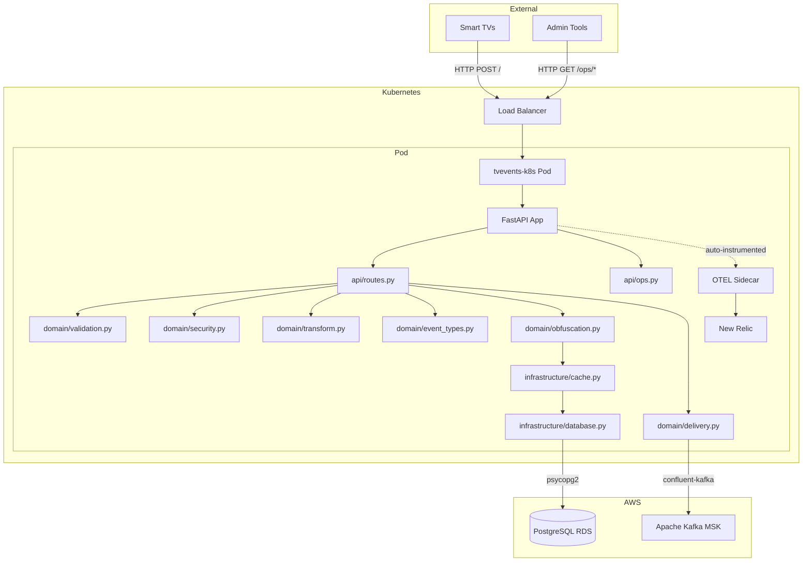
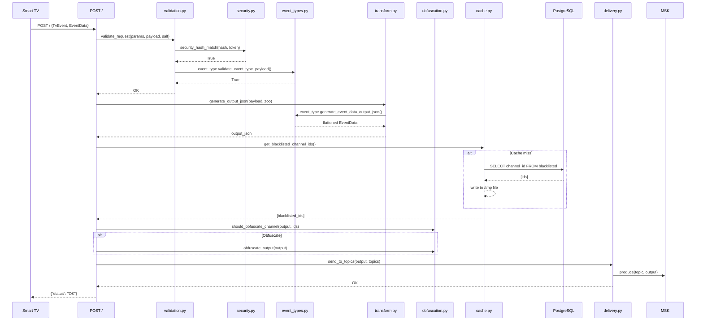
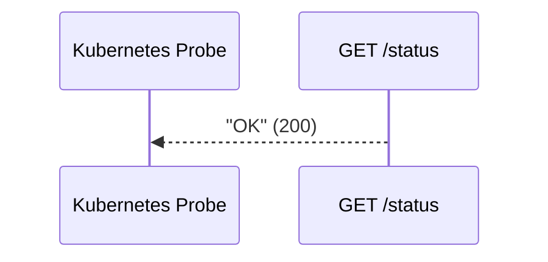
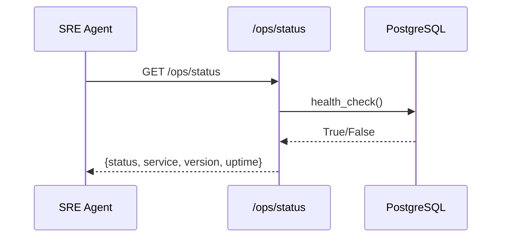

# Target Architecture — tvevents-k8s

## 1. What Changed

| Legacy Component | Target Module | What It Does |
|-----------------|---------------|--------------|
| `app/utils.py` (418 LOC) | `domain/security.py` (36) | HMAC hash generation and constant-time comparison |
| | `domain/validation.py` (129) | Required params, timestamp, security hash checks |
| | `domain/transform.py` (85) | JSON flattening, namespace extraction, output assembly |
| | `domain/obfuscation.py` (51) | Channel blacklist check and field obfuscation |
| `app/event_type.py` (260 LOC) | `domain/event_types.py` (204) | Event type dispatch, per-type validation and output |
| `app/dbhelper.py` (298 LOC) | `infrastructure/database.py` (94) | PostgreSQL client for blacklisted channel lookup |
| | `infrastructure/cache.py` (77) | File-based blacklist cache |
| `cnlib.token_hash` (external) | `domain/security.py` (inlined) | Eliminated external dependency — ADR-006 |
| `cnlib.firehose` (external) | `domain/delivery.py` (98) | Kafka producer replaces Firehose — ADR-002 |
| Flask app (`app/__init__.py`) | `main.py` + `api/routes.py` + `api/ops.py` | FastAPI with Pydantic models — ADR-001 |
| No ops endpoints | `api/ops.py` (263) | Full `/ops/*` diagnostic and remediation suite |
| No middleware | `middleware/metrics.py` (91) | Golden Signals / RED method metrics |
| No config validation | `config.py` (90) | `pydantic-settings` with type-safe env vars |

## 2. System Architecture



## 3. Data Flow Diagrams

### 3.1 Primary Write Path — TV Event Ingestion



### 3.2 Primary Read Path — Health/Status Check



### 3.3 Diagnostic Path — SRE Agent



## 4. What Changed and What Didn't

| Dimension | Legacy | Target |
|-----------|--------|--------|
| Deployable units | 1 Flask app | 1 FastAPI app |
| Repos | `evergreen-tvevents` | `rebuilder-evergreen-tvevents` |
| Data stores | PostgreSQL (RDS) | PostgreSQL (RDS) — unchanged |
| URL paths | `POST /`, `GET /status` | `POST /`, `GET /status`, `GET /health`, `/ops/*` |
| Response format | JSON | JSON (Pydantic models, OpenAPI spec) |
| Connection mgmt | `psycopg2` direct | `psycopg2` direct — unchanged |
| Message queue | AWS Kinesis Firehose | Apache Kafka (MSK) — ADR-002 |
| Framework | Flask | FastAPI — ADR-001 |
| Auth | HMAC hash (cnlib.token_hash) | HMAC hash (inlined) — ADR-006 |
| Shared libraries | `cnlib` (token_hash, firehose) | None — all inlined |
| Observability | Manual OTEL spans | OTEL auto-instrumentation |
| IaC | None | Terraform (envs: dev, staging, prod) |
| Containers | Docker | Docker — unchanged |
| Health checks | `GET /status` | `GET /status`, `GET /health`, `/ops/status`, `/ops/health` |
| Diagnostics | None | Full `/ops/*` suite (13 endpoints) |

## 5. Deployment Architecture

```
┌───────────────────────────────────────────┐
│              Kubernetes Pod                │
│                                           │
│  ┌─────────────────────────────────────┐  │
│  │        tvevents-k8s container       │  │
│  │                                     │  │
│  │  opentelemetry-instrument \         │  │
│  │    uvicorn tvevents.main:app        │  │
│  │                                     │  │
│  │  Probes:                            │  │
│  │    liveness:  GET /status           │  │
│  │    readiness: GET /health           │  │
│  │    startup:   GET /status           │  │
│  │                                     │  │
│  │  Ports: 8000 (HTTP)                 │  │
│  └─────────────────────────────────────┘  │
│                                           │
│  ┌─────────────────────────────────────┐  │
│  │    OTEL Collector sidecar           │  │
│  │    Ports: 4317 (gRPC), 4318 (HTTP)  │  │
│  │    Export: otlp → New Relic         │  │
│  └─────────────────────────────────────┘  │
│                                           │
└───────────────────────────────────────────┘
```

## 6. Features Intentionally Removed

| Feature | Justification | ADR |
|---------|--------------|-----|
| `cnlib.token_hash` dependency | Inlined — single HMAC function, no need for shared library | ADR-006 |
| `cnlib.firehose` dependency | Replaced by Kafka — Firehose deprecated | ADR-002 |
| Manual OTEL span creation | Auto-instrumentation covers HTTP, DB, Kafka | ADR-005 |
| Flask framework | Replaced by FastAPI for Pydantic, OpenAPI, async | ADR-001 |

## 7. Related Documents

- [Component Overview](component-overview.md) — module responsibilities and request flow
- [Feature Parity Matrix](feature-parity.md) — legacy vs. target feature comparison
- [Data Migration Mapping](data-migration-mapping.md) — data store transition plan
- [Observability](observability.md) — metrics, traces, logs, alerts
- [ADR Index](adr/adr-index.yaml) — all architectural decision records
