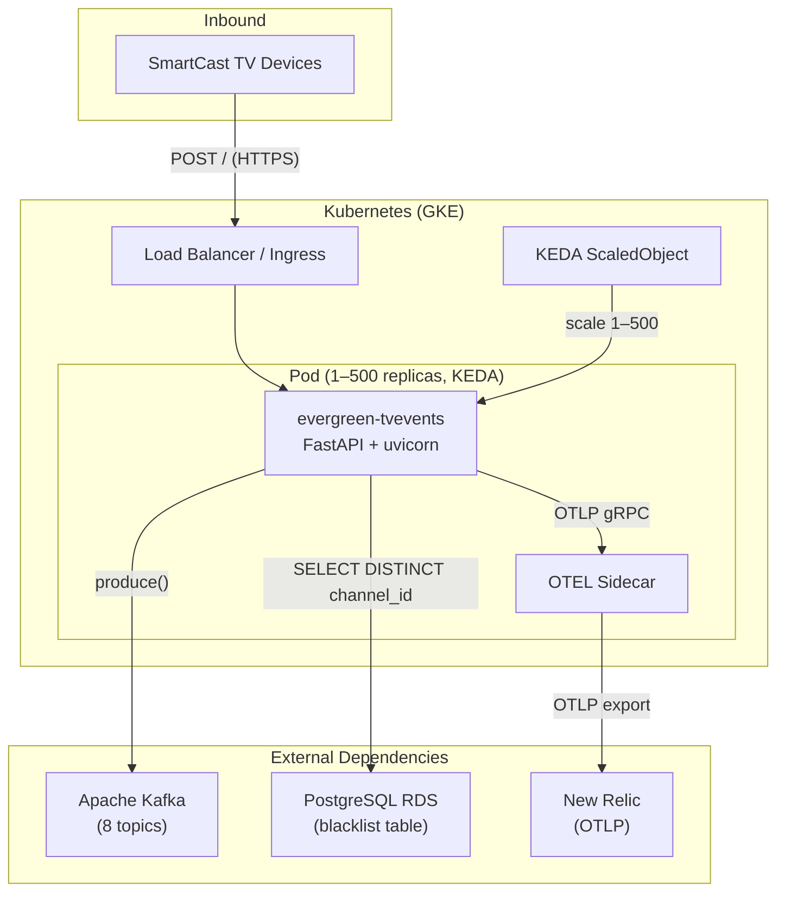
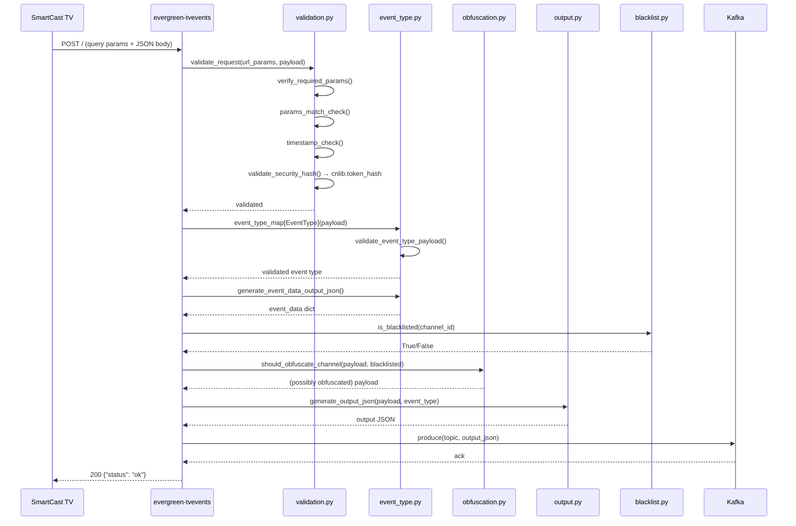
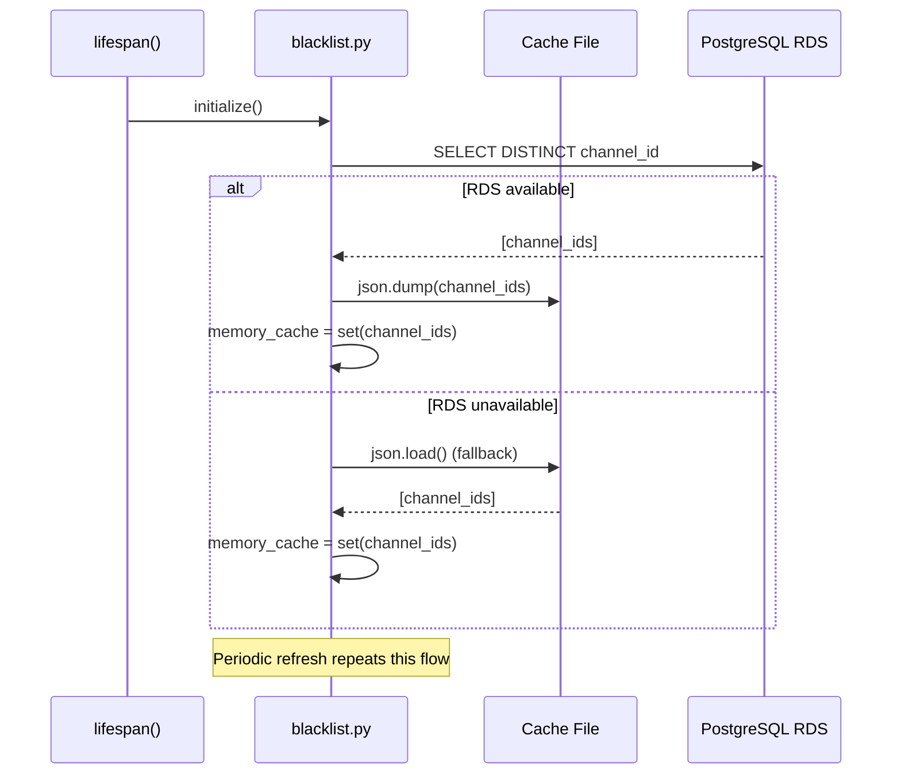
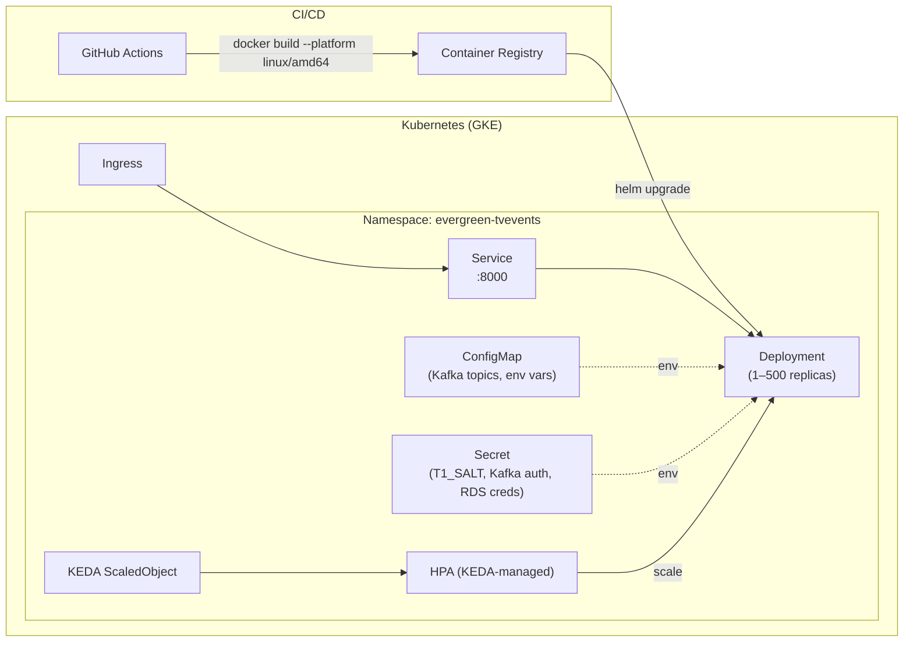

# Target Architecture — evergreen-tvevents

> Architecture documentation for the rebuilt service. Eight required sections.

---

## 1. What Changed

| Aspect | Legacy | Target | Rationale |
|---|---|---|---|
| Framework | Flask 2.x (WSGI) | FastAPI ≥ 0.115 (ASGI) | Native async, Pydantic validation, auto-generated OpenAPI |
| Runtime | Gunicorn + gevent (3 workers, 500 conn/worker) | uvicorn (configurable workers) | Eliminates monkey-patching, ASGI-native |
| Python | 3.10 | 3.12 | Security support, performance improvements |
| Event delivery | Kinesis Firehose (6 streams) via cnlib.firehose | Apache Kafka (8 topics) via standalone kafka_module | Decouple from AWS-specific service |
| Database access | Inline psycopg2 in dbhelper.py, no pooling | Standalone rds_module with connection pooling | Clean module boundary, connection reuse |
| OTEL setup | 48-line manual TracerProvider/MeterProvider/LoggerProvider | `FastAPIInstrumentor` auto-instrumentation + SDK providers | Less boilerplate, broader coverage |
| Request validation | Scattered across utils.py | Dedicated validation.py with Pydantic | Single-responsibility, type-safe |
| Error handling | Flask errorhandler | FastAPI exception_handler | Same response contract, ASGI-native |
| Test coverage | 0% | 88%+ (97 tests) | New capability |
| API documentation | None | OpenAPI at /docs (auto-generated) | New capability |
| SRE endpoints | None | 15 /ops/* endpoints | New capability — SRE agent contract |
| Dependency management | Flat requirements.txt | pip-compile with hash pinning (scripts/lock.sh) | Supply-chain integrity |
| Code organisation | 5 files, mixed concerns | 9 files, single-responsibility modules | Maintainability |
| Container user | flaskuser | containeruser (UID 10000) | Standard non-root pattern |
| Health checks | GET /status only | /status + /health + /ops/health (3-tier) | Richer liveness/readiness signals |

---

## 2. System Architecture

---

## 3. Data Flow

### 3.1 Event Ingestion (happy path)

### 3.2 Blacklist Cache Refresh

---

## 4. Library Relationship

| Library | Role | Legacy | Target | Change |
|---|---|---|---|---|
| cnlib.token_hash | T1_SALT HMAC security hash validation | Vendored in container | Vendored in container (unchanged) | None |
| cnlib.log | Structured JSON logging | Vendored in container | Vendored in container (unchanged) | None |
| cnlib.firehose | Kinesis Firehose producer | Vendored in container | **Removed** — replaced by kafka_module | Transport change |
| kafka_module | Kafka producer with topic routing | Not present | Standalone package | New — replaces cnlib.firehose |
| rds_module | PostgreSQL connection pooling | Not present | Standalone package | New — replaces inline psycopg2 |
| FastAPI | Web framework | Not present (Flask) | Core framework | Replaces Flask |
| Pydantic | Request/response validation | Not present | Via FastAPI | New |
| uvicorn | ASGI server | Not present (Gunicorn) | Runtime server | Replaces Gunicorn+gevent |
| opentelemetry-* | Distributed tracing, metrics, logs | Manual SDK setup | Auto-instrumentation + SDK | Simplified setup |
| psycopg2 | PostgreSQL driver | Direct usage in dbhelper.py | Via rds_module (pooled) | Same driver, better management |

---

## 5. Comparison — Legacy vs Target

| Dimension | Legacy | Target |
|---|---|---|
| Language version | Python 3.10 | Python 3.12 |
| Framework | Flask 2.x (WSGI, sync) | FastAPI ≥ 0.115 (ASGI, async-capable) |
| Runtime | Gunicorn + gevent (monkey-patched) | uvicorn (ASGI-native) |
| Event delivery | Kinesis Firehose (6 streams) | Apache Kafka (8 topics) |
| Database access | Inline psycopg2, no pooling | Standalone rds_module, connection pooling |
| Validation | Manual checks scattered in utils.py | Pydantic models + dedicated validation.py |
| Error handling | Flask errorhandler, ~2 exception classes | FastAPI exception handlers, 6 typed exceptions |
| Test coverage | 0% (no tests) | 88%+ (97 tests, 8 test files) |
| API documentation | None | Auto-generated OpenAPI at /docs |
| Observability | Manual OTEL (48 lines boilerplate) | Auto-instrumented + SDK (Golden Signals, RED) |
| SRE endpoints | None | 15 /ops/* diagnostic + remediation endpoints |
| Code structure | 5 files, mixed concerns | 9 source files, single-responsibility |
| Health checks | GET /status only | /status + /health + /ops/health + /ops/status |
| Dependency management | Flat requirements.txt | pip-compile + hash pinning |
| Container security | flaskuser, no HEALTHCHECK | containeruser (10000), HEALTHCHECK directive |

---

## 6. Deployment Architecture

**Scaling:** KEDA ScaledObject manages 1–500 replicas based on Kafka consumer
lag or HTTP request rate. Pod resources and limits defined in Helm values.

**Secrets:** T1_SALT, Kafka authentication credentials, and RDS connection
strings are injected via Kubernetes Secrets — never baked into the container
image.

---

## 7. Features Intentionally Removed

| Feature | Justification |
|---|---|
| cnlib.firehose dependency | Replaced by standalone Kafka module. JSON payloads byte-for-byte identical — only the transport layer changes. Per PRD Goal #2. |
| Flask framework | Replaced by FastAPI. Per PRD Goal #1. |
| Gunicorn + gevent runtime | Replaced by uvicorn. Eliminates monkey-patching. Per template-repo-python standard. |
| Manual OTEL boilerplate (48 lines) | Replaced by `FastAPIInstrumentor` auto-instrumentation. Per PRD Goal #5. |
| Flat requirements.txt | Replaced by pip-compile with hash pinning. Per PRD Goal #9. |

No user-facing features were removed. All legacy API behavior is preserved
(see [feature-parity.md](feature-parity.md) for the full status matrix).

---

## 8. Related Documents

| Document | Description |
|---|---|
| [README.md](../README.md) | Quick start, endpoint table, environment variables |
| [component-overview.md](component-overview.md) | 16-component inventory with rebuild actions |
| [data-migration-mapping.md](data-migration-mapping.md) | Schema mapping, cache file mapping, Firehose→Kafka topic mapping |
| [feature-parity.md](feature-parity.md) | Complete feature matrix with acceptance criteria |
| [observability.md](observability.md) | Service vs application metrics, Golden Signals, query examples |
| [charts/](../charts/) | Helm chart (Deployment, Service, KEDA ScaledObject) |
| [otel-collector-config.yaml](../otel-collector-config.yaml) | Local OTEL Collector configuration |
