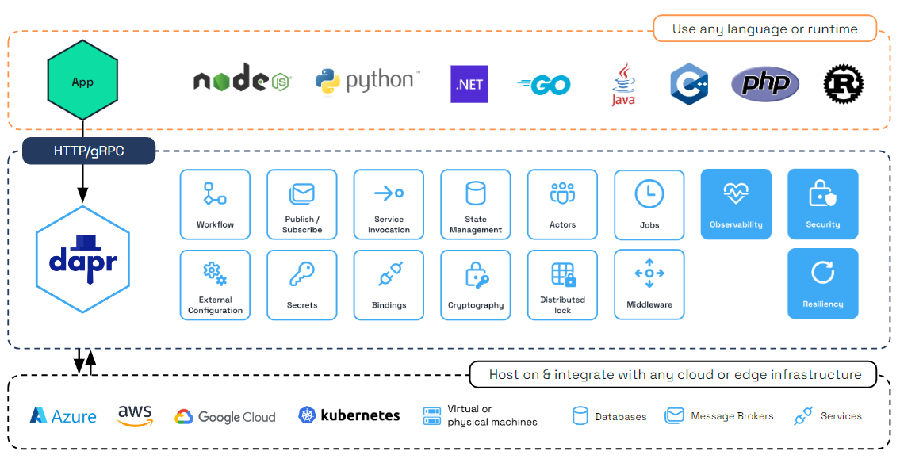

# Dapr Quick Reference

## What is Dapr?

Dapr (Distributed Application Runtime) provides building blocks for microservices via sidecars that run alongside your application. It handles object store service-to-service communication, state management, pub/sub, and more without requiring code changes.
## Core Concepts

**Sidecar Pattern**: Dapr runs as a sidecar container next to your app, intercepting calls and providing distributed system capabilities.

**Components**: Pluggable implementations (Object Store, Redis, Kafka, AWS services, etc.) configured via YAML.
https://docs.dapr.io/concepts/components-concept/
https://docs.dapr.io/reference/components-reference/supported-bindings/

**Input and Output Bindings**: Interface to components.
https://docs.dapr.io/getting-started/quickstarts/bindings-quickstart/



---

# Architecture & Enabling Dapr

## Dapr Architecture

```
┌─────────────────────────────────────────┐
│           Your Application              │
│         (Port 8000)                     │
└──────────────┬──────────────────────────┘
               │ HTTP/gRPC
               ▼
┌─────────────────────────────────────────┐
│        Dapr Sidecar (daprd)             │
│         HTTP: 3500                      │
│         gRPC: 50001                     │
│         Metrics: 9090                   │
└──────────────┬──────────────────────────┘
               │
               ▼
┌─────────────────────────────────────────┐
│    Dapr Components (Bindings, etc.)     │
│         (AWS S3, SQS, etc.)             │
└─────────────────────────────────────────┘
```
---

# Enabling Dapr in Your Service

## Helm values.yaml

```yaml
deployments:
  demo-app:
    dapr:
      enabled: true
      appId: "demo-app"
      appPort: 8000
```

## Helm values.yaml (With 'object-store' Component)

```yaml
daprComponents:
  demo-app:
    enabled: true
    annotations:
      dapr.io/enabled: "true"
      dapr.io/app-id: "demo-app"
      dapr.io/app-port: "8000"
    cloudProviders:
      aws:
        components:
          - name: "object-storage"
            aws:
              type: "bindings.aws.s3"
              metadata:
                - name: "bucket"
                  value: "my-bucket"
                - name: "region"
                  value: "us-east-1"
      gcp:
        components:
          - name: "object-storage"
            gcp:
              type: "bindings.gcp.bucket"
              metadata:
                - name: "bucket"
                  value: "my-gcs-bucket"
                - name: "project_id"
                  value: "my-project-id"
```

---

# S3/Python Implementation - Upload

```python
from flask import Flask, request, jsonify
import requests

app = Flask(__name__)
DAPR_BINDING_URL = "http://localhost:3500/v1.0/bindings/object-storage"

@app.route('/upload', methods=['POST'])
def upload_file():
    data = request.json
    file_name = data.get('fileName')
    file_content = data.get('content')
    
    response = requests.post(
        DAPR_BINDING_URL,
        json={
            "operation": "create",
            "data": file_content,
            "metadata": {"key": file_name}
        }
    )
    
    if response.status_code == 200:
        return jsonify({"status": "uploaded", "fileName": file_name}), 200
    else:
        return jsonify({"error": "Upload failed"}), 500
```

---

# S3/Python Implementation - Download, List, Delete

```python
@app.route('/download/<file_name>', methods=['GET'])
def download_file(file_name):
    """Download a file from S3 via Dapr binding"""
    
    response = requests.post(
        DAPR_BINDING_URL,
        json={
            "operation": "get",
            "metadata": {"key": file_name}
        }
    )
    
    if response.status_code == 200:
        file_data = response.json()
        return jsonify({
            "fileName": file_name,
            "content": file_data.get("data"),  # Base64 encoded
            "metadata": file_data.get("metadata", {})
        }), 200
    else:
        return jsonify({"error": "File not found"}), 404
```

### Python Implementation - List Files

```python
@app.route('/files', methods=['GET'])
def list_files():
    """List files in S3 bucket via Dapr binding"""
    
    response = requests.post(
        DAPR_BINDING_URL,
        json={
            "operation": "list",
            "metadata": {"maxResults": "100"}
        }
    )
    
    if response.status_code == 200:
        files = response.json()
        return jsonify({
            "files": files.get("data", []),
            "count": len(files.get("data", []))
        }), 200
    else:
        return jsonify({"error": "Failed to list files"}), 500
```

### Python Implementation - Delete File

```python
@app.route('/delete/<file_name>', methods=['DELETE'])
def delete_file(file_name):
    """Delete a file from S3 via Dapr binding"""
    
    response = requests.post(
        DAPR_BINDING_URL,
        json={
            "operation": "delete",
            "metadata": {"key": file_name}
        }
    )
    
    if response.status_code == 200:
        return jsonify({"status": "deleted", "fileName": file_name}), 200
    else:
        return jsonify({"error": "Delete failed"}), 500
```

---

# Binding Operations

| Operation | Description | Metadata Fields |
|-----------|-------------|-----------------|
| `create` | Upload file | `key` (required), `ContentType` |
| `get` | Download file | `key` (required) |
| `delete` | Delete file | `key` (required) |
| `list` | List files | `maxResults`, `prefix` |

## Key Takeaways

1. **Simple API**: Just POST to `localhost:3500/v1.0/bindings/object-storage`
2. **No AWS SDK needed**: Dapr handles all S3 interactions
3. **IAM role support**: Uses pod identity automatically
4. **Operations**: create, get, delete, list
5. **Metadata**: Pass S3-specific options via metadata field

---

# Debugging & Best Practices

## Debugging

### View Dapr Sidecar Logs

```bash
# Get pod name
kubectl get pods -n demo-app

# View daprd logs
kubectl logs <pod-name> -c daprd -n demo-app

# Follow logs
kubectl logs <pod-name> -c daprd -n demo-app -f
```

### Check Dapr Configuration

```bash
# List components
kubectl get components -n demo-app

# Describe component
kubectl describe component s3-bucket -n demo-app
```

## Best Practices

1. **Use App IDs consistently**: Match your service name for clarity
2. **Set appPort correctly**: Must match your application's listening port
3. **Enable metrics**: Dapr exports Prometheus metrics by default
4. **Leverage components**: Don't hardcode infrastructure - use Dapr components
5. **Handle errors gracefully**: Always check response status codes
6. **Use structured logging**: Include trace IDs for distributed tracing
7. **Monitor sidecar health**: Check daprd logs for issues

## Resources

- [Dapr Documentation](https://docs.dapr.io/)
- [Dapr Python SDK](https://github.com/dapr/python-sdk)
- [Building Blocks Overview](https://docs.dapr.io/concepts/building-blocks-concept/)
---

# Thank you!